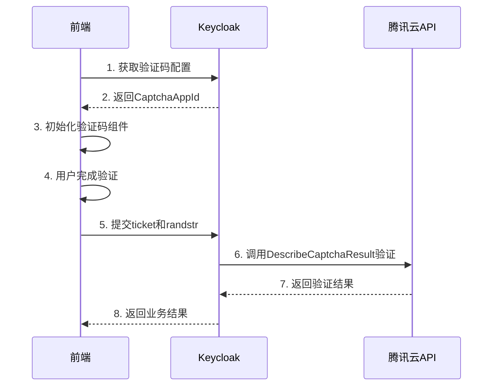

# Keycloak 腾讯云验证码提供者

这是一个为Keycloak手机验证码提供者项目集成腾讯云验证码服务的模块。

## 功能特性

- 支持腾讯云验证码2.0版本
- 支持多种验证码类型（滑块、文字点选、图形点选等）
- 完整的后端验证逻辑
- 提供REST API供前端获取验证码配置
- 支持通过配置文件灵活切换验证码服务提供者

## 依赖关系

本模块依赖：
- `keycloak-phone-provider` 核心模块（提供SPI接口）
- 腾讯云验证码Java SDK (`tencentcloud-sdk-java-captcha`)
- Keycloak 25.x

## 配置说明

### Keycloak 25 配置方式

Keycloak 25基于Quarkus架构，提供三种配置方式：

#### 1. 使用 keycloak.conf 配置文件（推荐）

在 `conf/keycloak.conf` 中添加：

```properties
# 设置默认的验证码服务提供者为腾讯云
spi-captcha-service-provider=tencent

# 配置腾讯云验证码服务
spi-captcha-service-tencent-secret-id=YOUR_SECRET_ID
spi-captcha-service-tencent-secret-key=YOUR_SECRET_KEY
spi-captcha-service-tencent-captcha-app-id=YOUR_CAPTCHA_APP_ID
spi-captcha-service-tencent-app-secret-key=YOUR_APP_SECRET_KEY

# 可选配置（一般不需要配置以下参数）
# spi-captcha-service-tencent-captcha-type=9
spi-captcha-service-tencent-endpoint=captcha.tencentcloudapi.com
spi-captcha-service-tencent-fallback-on-error=false
```

#### 2. 使用环境变量

适合Docker/Kubernetes等容器化部署：

```bash
export KC_SPI_CAPTCHA_SERVICE_PROVIDER=tencent
export KC_SPI_CAPTCHA_SERVICE_TENCENT_SECRET_ID=YOUR_SECRET_ID
export KC_SPI_CAPTCHA_SERVICE_TENCENT_SECRET_KEY=YOUR_SECRET_KEY
export KC_SPI_CAPTCHA_SERVICE_TENCENT_CAPTCHA_APP_ID=YOUR_CAPTCHA_APP_ID
export KC_SPI_CAPTCHA_SERVICE_TENCENT_APP_SECRET_KEY=YOUR_APP_SECRET_KEY

# 可选配置（一般不需要）
# export KC_SPI_CAPTCHA_SERVICE_TENCENT_CAPTCHA_TYPE=9
```

#### 3. 使用启动命令参数

适合临时配置或测试：

```bash
bin/kc.sh start \
  --spi-captcha-service-provider=tencent \
  --spi-captcha-service-tencent-secret-id=YOUR_SECRET_ID \
  --spi-captcha-service-tencent-secret-key=YOUR_SECRET_KEY \
  --spi-captcha-service-tencent-captcha-app-id=YOUR_CAPTCHA_APP_ID \
  --spi-captcha-service-tencent-app-secret-key=YOUR_APP_SECRET_KEY
  # 可选: --spi-captcha-service-tencent-captcha-type=9
```

### 配置参数说明

| 参数名 | 必填 | 说明 | 默认值 |
|--------|------|------|--------|
| `secretId` | 是 | 腾讯云API密钥ID | 无 |
| `secretKey` | 是 | 腾讯云API密钥Key | 无 |
| `captchaAppId` | 是 | 验证码应用ID（在腾讯云控制台创建） | 无 |
| `appSecretKey` | 是 | 验证码应用密钥 | 无 |
| `captchaType` | 否 | 验证码类型（可选，腾讯云会自动识别）<br>如需明确指定：9=滑块，其他类型见腾讯云文档 | 自动识别 |
| `endpoint` | 否 | API端点 | captcha.tencentcloudapi.com |
| `fallbackOnError` | 否 | API错误时是否放行验证 | false |

**注意**: 
- 验证码类型（滑块、文字点选、图形点选等）在腾讯云控制台创建验证码应用时配置
- `captchaType` 参数通常不需要配置，腾讯云会根据 `captchaAppId` 自动识别验证码类型
- 只有在特殊情况下需要强制指定类型时，才配置 `captchaType` 参数

### 切换验证码服务

要切换到不同的验证码服务提供者，只需修改 `spi-captcha-service-provider` 配置：

- 使用腾讯云：`spi-captcha-service-provider=tencent`
- 使用Google reCAPTCHA：`spi-captcha-service-provider=recaptcha`
- 使用极验：`spi-captcha-service-provider=geetest`

## 构建部署

### 构建项目

```bash
# 在项目根目录执行
mvn clean package -DskipTests

# 或者只构建本模块
cd keycloak-captcha-provider-tencent
mvn clean package
```

### 部署到Keycloak

1. 将生成的JAR文件复制到Keycloak的providers目录：
   ```bash
   cp target/providers/keycloak-captcha-provider-tencent.jar $KEYCLOAK_HOME/providers/
   ```

2. 重启Keycloak或执行build命令：
   ```bash
   bin/kc.sh build
   bin/kc.sh start
   ```

## API端点

前端可以通过以下REST API获取验证码配置：

```
GET /realms/{realm}/tencent/code
```

返回格式：
```json
{
  "success": 1,
  "captchaAppId": "YOUR_CAPTCHA_APP_ID"
}
```

## 前端集成

前端需要：

1. 调用API获取CaptchaAppId
2. 加载腾讯云验证码SDK
3. 初始化验证码组件
4. 用户完成验证后获取 `ticket` 和 `randstr`
5. 将 `ticket` 和 `randstr` 提交到后端进行验证

详细的前端集成步骤请参考[腾讯云验证码文档](https://cloud.tencent.com/document/product/1110/36334)。

## 验证流程



## 技术实现

本模块包含以下核心组件：

- **TencentCaptchaServiceImpl**: 核心服务实现，处理验证码验证逻辑
- **TencentCaptchaServiceProviderFactory**: 服务提供者工厂
- **TencentCaptchaResource**: REST资源，提供HTTP端点
- **TencentCaptchaResourceProvider**: 资源提供者
- **TencentCaptchaResourceProviderFactory**: 资源提供者工厂

## 参考文档

- [腾讯云验证码产品文档](https://cloud.tencent.com/document/product/1110/36334)
- [腾讯云Java SDK文档](https://cloud.tencent.com/document/sdk/Java)
- [Keycloak SPI开发指南](https://www.keycloak.org/docs/latest/server_development/)

## 许可证

与父项目保持一致

## 作者

根据现有的 recaptcha 和 geetest 模块参考实现
